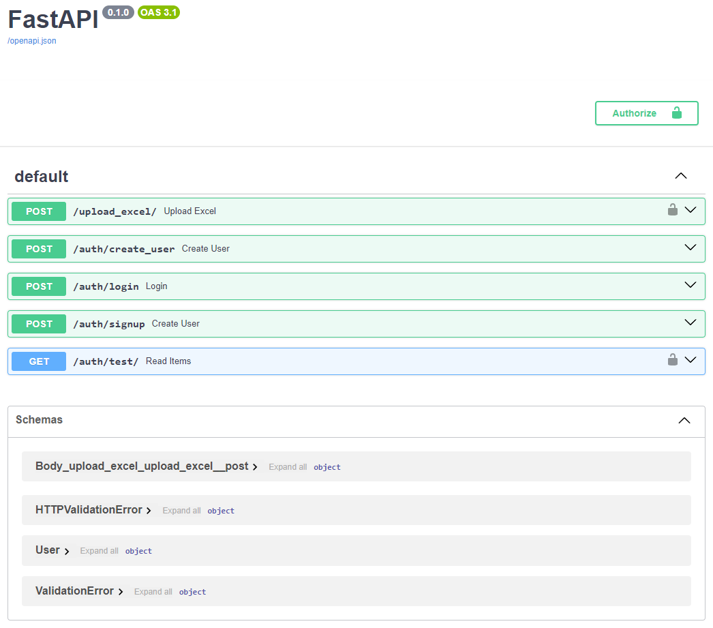

# Backend of Retail Company BI Platform

## About this part

This is a backend for Retail Company BI System. Main libraries of this project are FastAPI and SQL Alchemy.
Now it works in local environment (python 3.10), but I'm going to make a docker container later.

## API

Below you can see a screenshot of this API Swagger documentation

## How to run

To run backend, you should do the following steps:

1. Install all packages from requirements.txt in your virtual environment (venv). 
2. Create and set up a config.ini file in src/config/ 
(There is an example of config-file 'src/config/config.ini.sample'.)
3. Run src/main.py
